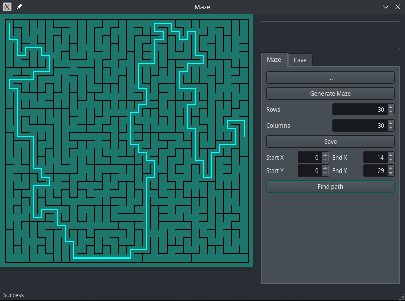
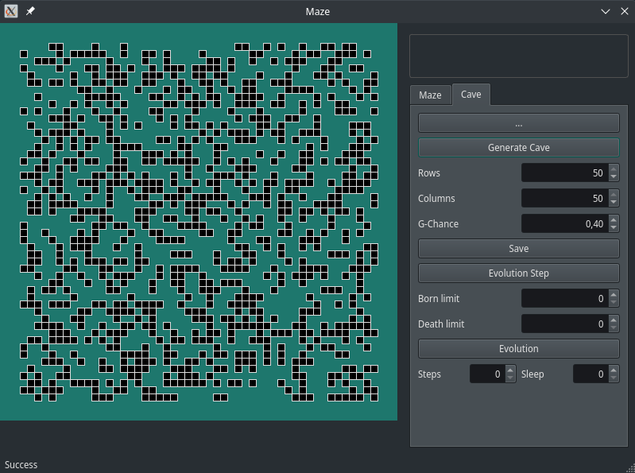

# Maze

В проекте реализовано приложение для отображения работы алгоритмов обработки лабиринтов и пещер, включая их генерацию, отрисовку и поиск решения

## Описание

- Программа разработана на языке С++ стандарта C++17 с использованием компилятора g++
- Программа реализована с использованием паттерна MVC 
- Код программы находится в папке src 
- Сборка программы настроена с помощью Makefile со стандартным набором целей для GNU-программ: all, install, uninstall, clean, dvi, dist, test, gcov_report. Установка производится в каталог Maze/build
- Программа разработана в парадигме объектно-ориентированного программирования
- Обеспечено покрытие unit-тестами модулей, связанных с вычислением выражений, с помощью библиотеки GTest
- Графический пользовательский интерфейс реализован на базе Qt
- Средство автоматизации сборки CMake

## Описание функционала "Лабиринт"

- В программе предусмотрена загрузка лабиринта из файла. Лабиринт хранится в файле в виде количества строк и столбцов, а также двух матриц, содержащих положение вертикальных и горизонтальных стен соответственно.
В первой матрице отображается наличие стены справа от каждой ячейки, во второй - снизу
- Имеется возможность генерации лабиринта по алгоритму Эллера (пользователем задается размерность лабиринта - количество строк и столбцов)
- Максимальный размер лабиринта - 50х50
- Имеется возможность показать решение лабиринта, который изображен на экране (пользователем задаются начальная и конечная точки)
- Лабиринт, который изображен на экране, можно сохранить в файл

## Описание функционала "Пещера"

- В программе предусмотрена загрузка пещеры из файла. Пещера хранится в файле в виде количества строк и столбцов,
а также матрицы, содержащей положение "живых" и "мертвых" клеток
- Имеется возможность генерации лабиринта с использованием клеточного автомата (пользователем задаются пределы "рождения" и "смерти" клетки, а также шанс на начальную инициализацию клетки)
- Максимальный размер лабиринта - 50х50
- Предусмотрен пошаговый режим отрисовки результатов работы алгоритма в двух вариантах:
    - По нажатию на кнопку следующего шага отрисовывается очередная итерация работы алгоритма
    - По нажатию на кнопку автоматической работы запускается отрисовка итераций работы алгоритма с частотой 1 шаг в `N` миллисекунд, где число миллисекунд `N` задаётся через специальное поле в пользовательском интерфейсе
- Пещеру, которая изображена на экране, можно сохранить в файл
